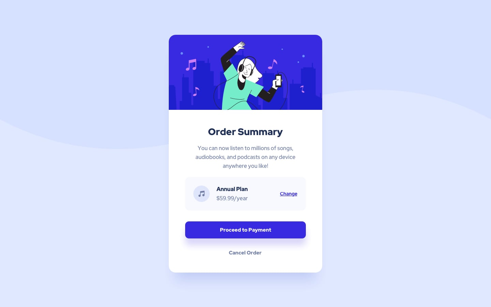

# 📦 Order Summary Component

Projeto desenvolvido a partir de um desafio do Frontend Mentor com foco em praticar **HTML semântico**, **CSS moderno**, responsividade e construção de componentes visuais elegantes.

---

<div align="center">

# 🎵 Order Summary Component

Uma interface moderna e responsiva para resumo de assinatura e pagamento.


</div>

---

## 🔗 Links

🌐 **Live Site:**
👉 [Order Summary Component Live](https://anaclarissi.github.io/order-summary-component/?utm_source=chatgpt.com)

📂 **Repositório:**
👉 [order-summary-component Repository](https://github.com/anaClarissi/order-summary-component?utm_source=chatgpt.com)

🎯 **Desafio Frontend Mentor:**
👉 [Frontend Mentor Challenge - Order Summary Component](https://www.frontendmentor.io/challenges/order-summary-component-QlPmajDUj?utm_source=chatgpt.com)

👩‍💻 **Meu perfil no Frontend Mentor:**
👉 [Ana Clarissi on Frontend Mentor](https://www.frontendmentor.io/profile/anaClarissi?utm_source=chatgpt.com)

---

# 🖥️ Preview

## 💻 Desktop

<div align="center">
  
</div>

---

## 📱 Mobile

<div align="center">
  
</div>

---

# 🚀 Tecnologias Utilizadas

<div align="center">


</div>

---

# 📚 Sobre o Projeto

Este projeto representa um componente de resumo de pedido moderno e totalmente responsivo.

O desafio teve como objetivo praticar:

* Estruturação semântica com HTML5
* Flexbox para alinhamento de elementos
* Responsividade para diferentes dispositivos
* Organização visual de componentes
* Efeitos hover e transições suaves
* Utilização de variáveis CSS
* Aplicação de background responsivo

---

# 🎨 Funcionalidades

✅ Card centralizado na tela
✅ Layout responsivo
✅ Botões com hover effects
✅ Plano de assinatura destacado
✅ Background adaptável para desktop e mobile
✅ Design moderno inspirado no Frontend Mentor

---

# 📂 Estrutura do Projeto

```bash
📦 order-summary-component
 ┣ 📂 assets
 ┃ ┣ 📂 css
 ┃ ┃ ┗ 📜 style.css
 ┃ ┣ 📂 images
 ┃ ┗ 📂 fonts
 ┣ 📜 index.html
 ┗ 📜 README.md
```

---

# 💡 Aprendizados

Durante o desenvolvimento deste projeto, pratiquei:

* Criação de componentes responsivos
* Organização de layout com Flexbox
* Manipulação de backgrounds adaptativos
* Estruturação visual limpa e moderna
* Utilização de variáveis CSS para padronização
* Aplicação de sombras e transições

---

# 🔧 Melhorias Futuras

* Adicionar animações mais elaboradas
* Implementar modo dark/light
* Adicionar interatividade com JavaScript
* Melhorar acessibilidade do componente

---

# 👩‍💻 Autora

Feito com 💜 por [Ana Clarissi GitHub](https://github.com/anaClarissi?utm_source=chatgpt.com)

---

# 🙌 Créditos

Desafio proposto pela plataforma [Frontend Mentor](https://www.frontendmentor.io?utm_source=chatgpt.com)
